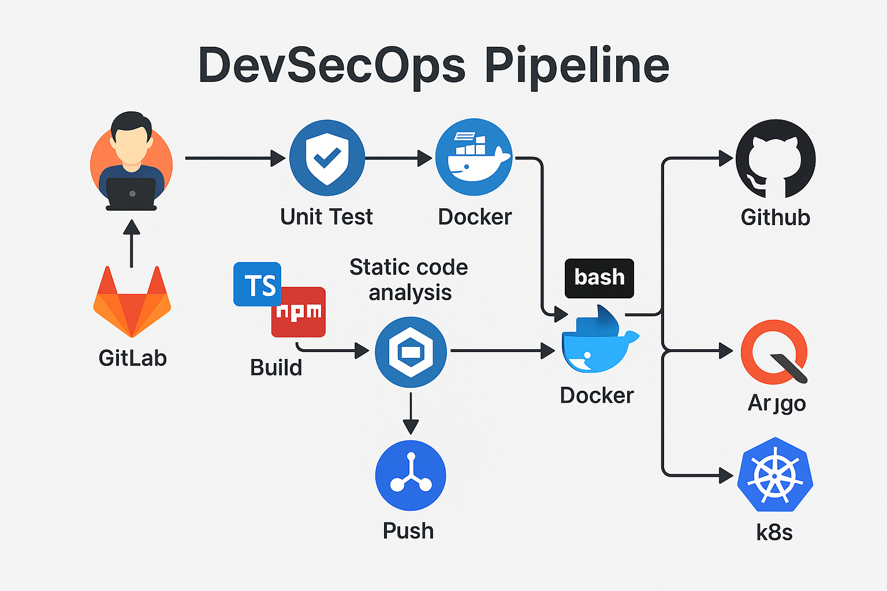

# DevSecOps Pipeline Implementation

This project demonstrates a complete DevSecOps pipeline architecture that integrates security practices throughout the CI/CD workflow.

## 🔧 Key Components

- **Version Control**: Git/GitHub
- **Unit Testing**: TypeScript
- **Static Code Analysis**: npm tools
- **Build and Dockerization**: Docker
- **Security Scanning**: Trivy
- **Image Tagging and Push**: Bash + GitHub Registry
- **Deployment**: Argo CD + Kubernetes (k8s)

## 📷 Architecture Diagram

## 💡 Highlights

- Security-first CI/CD
- Automated deployment to Kubernetes
- Clear integration points using modern DevOps tools

## 🏁 Get Involved

Feel free to fork this repository, suggest improvements, or reach out to discuss best practices in DevSecOps!

---

#DevSecOps #CI/CD #Security #Kubernetes #ArgoCD #Docker
